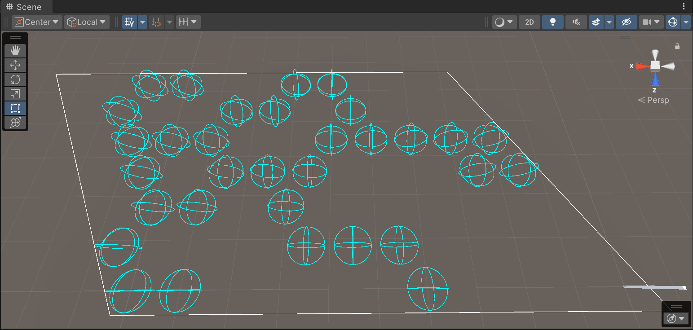
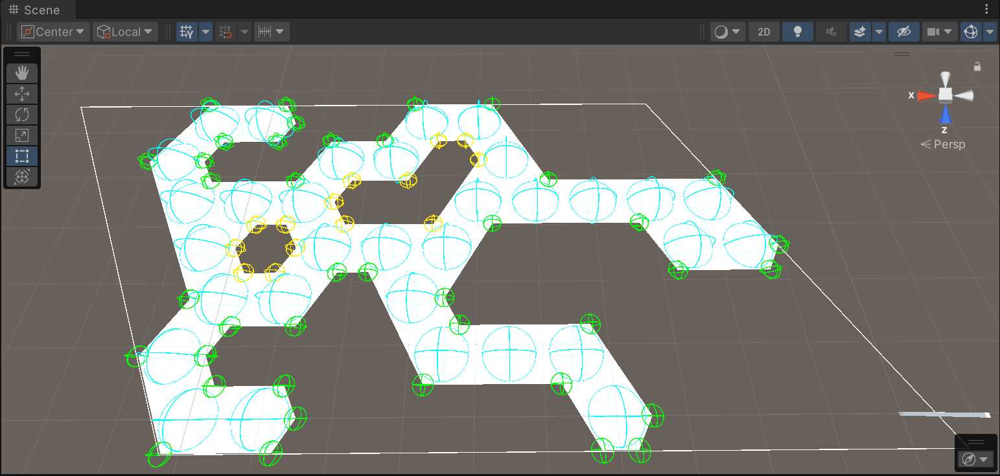

# Galactic Runaway

This was supposed to be some cool game with turn-based combat on hexagonal grid.

It did get procedural mesh generation:

This logic may be used for highlighting a contiguous 'island' of available move destinations for selected unit (in single plane).
